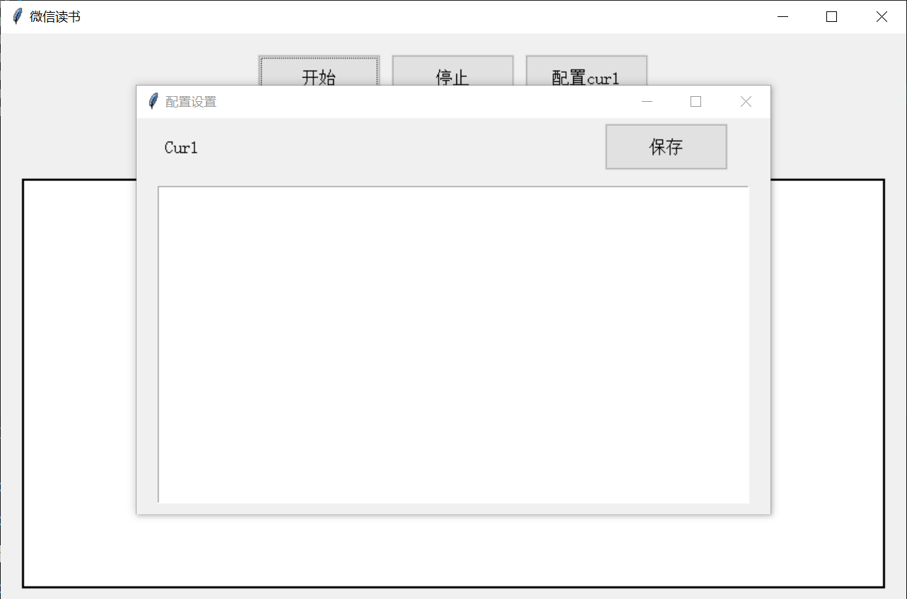
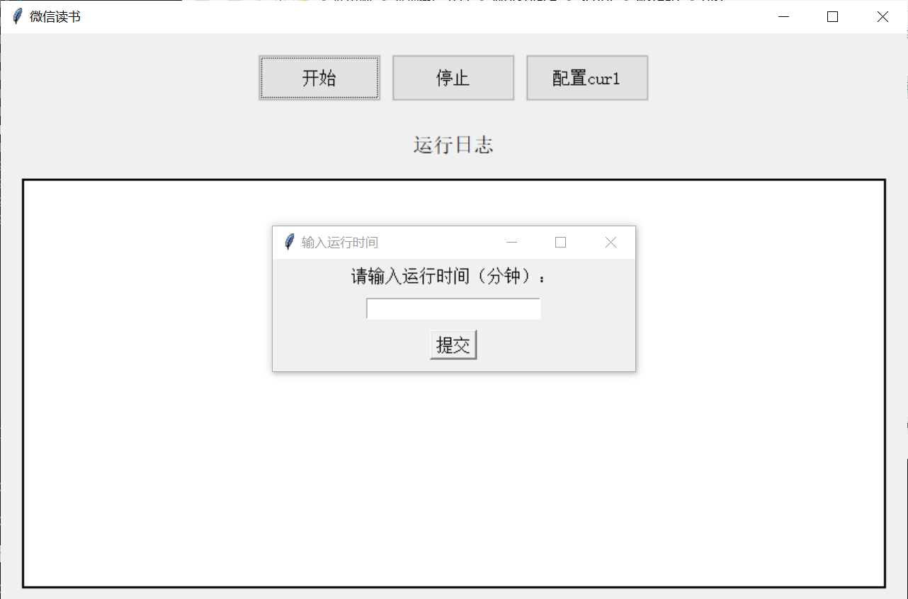
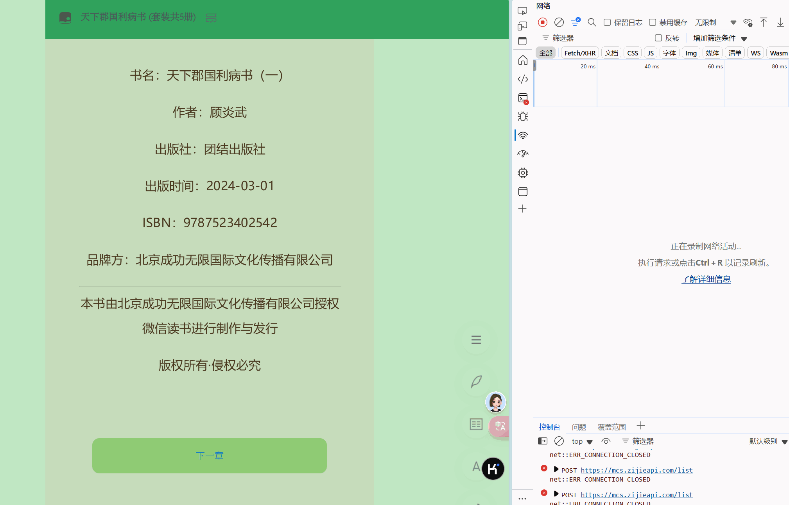

# 微信读书自动阅读脚本

轻量级微信读书脚本，自动阅读刷时间

## 功能

分为三种种运行方式：github、python、app。

### github

参考 [findmover/wxread](https://github.com/findmover/wxread)

### python

`uv run main.py`

1. 配置环境 `uv sync`
2. 阅读支持多账户阅读，阅读书籍从 `config/curl_config.sh` 文件中读取。
3. 多账户阅读需要将所有 `curl` 信息以 `.sh` 保存到 `config` 文件夹中。

### 应用

```
scoop bucket add code https://github.com/morning-start/code-bucket
scoop install code/wxread
```

1. 保存curl
2. 阅读功能
3. 阅读中止
4. 显示过程日志
5. 清除日志

## 使用

### python运行

1. 自行创建 `config` 文件夹，将curl信息复制到 `curl_config.sh` 中。
2. 使用 python 运行 `main.py`

### exe 运行

过程中会保存一个 `curl_config.sh` 文件，保存请求信息。

## 使用说明

点击开始按钮，按照提示操作即可





### curl 获取说明

打开想要阅读的书籍，然后按 `f12` 进入开发者模式，选择 `network` 选项，然后点击**下一章**，得到 `reed` 的请求，然后右键，复制 `curl （bash)`，粘贴到配置框中。




## 项目结构

### 文件结构

```
├── api
│   ├── notifier.py     # 推送通知模块，支持 PushPlus、Telegram 和 WxPusher
│   └── reader.py       # 核心阅读功能模块，模拟微信读书行为
├── README.md           # 项目说明文档
├── app.py              # 主程序入口（未使用）
├── build.py            # 构建脚本（未使用）
├── main.py             # 程序启动文件，控制阅读时长和推送方式
├── multi_main.py       # 多账户支持的启动文件
└── pyproject.toml      # Python项目配置文件
```

### 模块说明

#### api/notifier.py
- **PushPlusNotifier**：PushPlus消息推送类，实现消息推送功能
- **TelegramNotifier**：Telegram消息推送类，支持代理和直连两种方式
- **WxPusherNotifier**：WxPusher消息推送类，支持简单的消息推送
- **Notifier**：统一推送接口类，根据配置选择不同的推送方式

#### api/reader.py
- **WXReader**：微信读书SDK核心类，包含以下功能：
  - `read`：执行阅读操作
  - `refresh_cookie`：刷新cookie密钥
  - `_fix_no_synckey`：修复无 synckey 的情况
  - `cal_hash`：计算哈希值，用于请求签名
  - `parse_curl_bash`：解析 curl 命令，提取 headers、cookies 和 payload
  - `sync_run`：同步运行方法，循环执行阅读任务

#### main.py
- 控制程序的主要逻辑，包括：
  - 从环境变量读取配置
  - 解析 curl 命令获取请求配置
  - 创建 WXReader 实例
  - 根据配置创建 Notifier 实例
  - 运行阅读任务，支持推送通知

#### multi_main.py
- 支持多账号的主程序，可以同时为多个微信读书账号执行阅读任务

#### 其他文件
- **README.md**：项目简介和使用说明
- **pyproject.toml**：Python项目配置文件，包含项目元数据和依赖信息

## 致谢

- [findmover/wxread](https://github.com/findmover/wxread) 从这个项目得到的基础 api 设计
